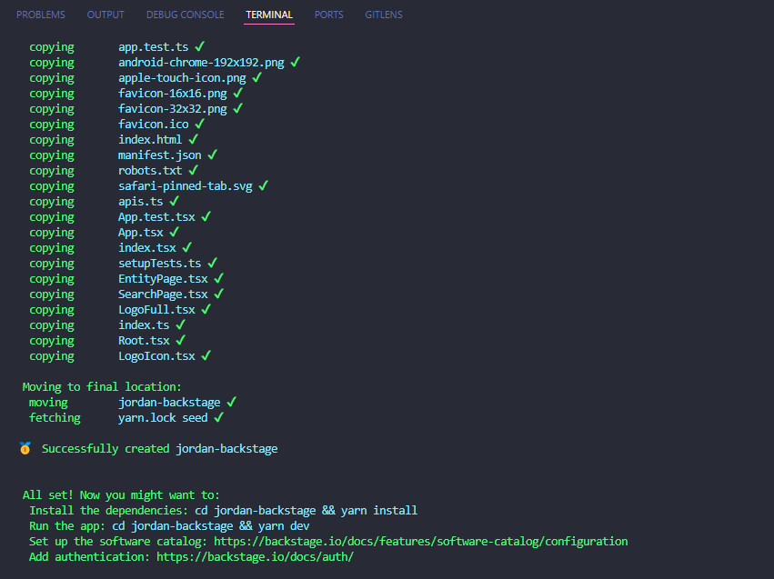

# Guia de Instalação e Configuração do Backstage

O Backstage é uma plataforma de desenvolvimento de software open-source criada pelo Spotify. É projetado para ajudar as equipes a gerenciar seus serviços de software e automações, integrando as melhores práticas no local de trabalho. Com o Backstage, você pode criar uma visão clara de todos os seus serviços, permitindo uma melhor orientação para os desenvolvedores e uma operação mais eficiente.

## Pré-Requisitos

Antes de iniciar, é necessário certificar-se de que já tenha sido instalado na máquina as seguintes dependências:
- Node.js (v14 ou superior)
- Yarn
- Docker

## Instalação do Backstage

* Primeiro, cria-se a aplicação Backstage com o comando:
```
npx @backstage/create-app@latest --skip-install
```

* Durante a execução, é necessário definir um nome para a aplicação (que nesse caso foi jordan-backstage)
<br>

* Depois de criar a aplicação, deve-se navegar até a pasta da aplicação e instalar as dependências necessárias com:

```
cd [nome-da-aplicação] // jordan-backstage
yarn install
```

* Caso o Yarn esteja desatualizado, basta executar:

```
npm install --global yarn
```
## Preparação do Build

* Em seguida, é necessário instalar as dependências necessárias com a integridade do arquivo lock mantida:
```
yarn install --frozen-lockfile
```

* Após essa etapa, vem a preparação dos tipos com o TypeScript
```
yarn tsc
```

* O próximo passo é construir o backend com:
```
yarn build:backend
```

## Ajuste do Dockerfile

* O projeto deve ser aberto no Visual Studio Code, em seguida, deve-se navegar até packages/backend/Dockerfile e substituir seu conteúdo pelo seguinte Dockerfile, que foi ajustado a partir do guia oficial:

```
FROM node:18-bookworm-slim
# Instala as dependências necessárias para o plugin scaffolder-backend
RUN apt-get update && apt-get install -y python3 g++ build-essential && yarn config set python /usr/bin/python3
# Instala dependências para sqlite3, se necessário
RUN apt-get update && apt-get install -y libsqlite3-dev
USER node
WORKDIR /app
ENV NODE_ENV development
COPY --chown=node:node yarn.lock package.json packages/backend/dist/skeleton.tar.gz ./
RUN tar xzf skeleton.tar.gz && rm skeleton.tar.gz
RUN yarn install --frozen-lockfile --production --network-timeout 300000
COPY --chown=node:node packages/backend/dist/bundle.tar.gz app-config*.yaml ./
RUN tar xzf bundle.tar.gz && rm bundle.tar.gz
CMD ["node", "packages/backend", "--config", "app-config.yaml"]
```

## Rodando o backstage com docker

* A imagem Docker deve ser construída sem reutilizar camadas de cache:

```
docker image build . -f packages/backend/Dockerfile --tag backstage --no-cache
```

* O container deve ser executado, mapeando a porta 7007:

```
docker run -it -p 7007:7007 backstage
```

## O que se pode aprender com o Backstage?

* Utilizar o Backstage facilita a gestão de infraestruturas, recursos e automações, promovendo a integração contínua e centralizando as ferramentas de desenvolvimento. Ele fornece uma visão clara sobre os serviços de desenvolvimento, essencial para grandes equipes e organizações.

## Importância do Backstage

A importância do Backstage está em sua capacidade de simplificar a complexidade operacional e técnica, funcionando como uma plataforma única onde desenvolvedores encontram informações sobre software, dados e ferramentas, melhorando a eficiência e colaboração entre equipes.

## Evidências


